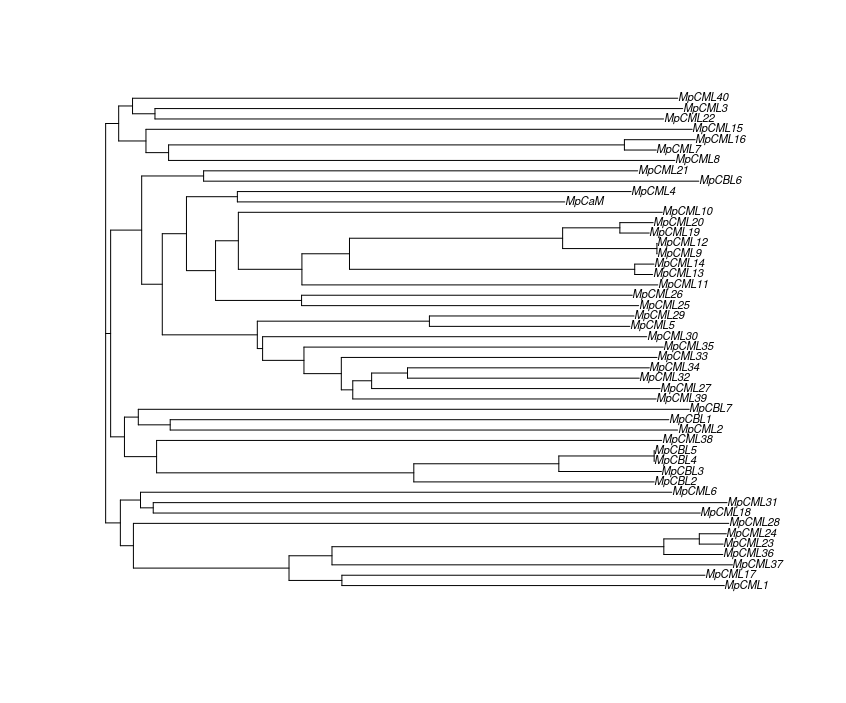

```{r setup, include=FALSE}
knitr::opts_chunk$set(echo = FALSE)
```

```{r sourcing scripts, message=FALSE}

source("/cloud/project/scripts/mp_gene_table.R")


```


\newpage
# Abstract
Calcium signaling plays a fundamental role in plant responses to environmental stimuli, mediated by intricate networks of proteins such as Calmodulins (*CaMs*), Calmodulin-like proteins (*CMLs*), and Calcineurin B-like proteins (*CBLs*). This study aimed to elucidate the repertoire of *CaM*, *CML*, and *CBL* genes in the non-vascular basal land plant *Marchantia polymorpha* to enhance our understanding of calcium signaling in plants. Using a combination of bioinformatics tools and molecular techniques, we identified 48 potential homologs of these genes in *M. polymorpha*. Phylogenetic analysis revealed evolutionary relationships among these genes, aiding in their classification and functional inference. Analysis of expression data provided insights into the tissue-specific, stress-responsive and diurnal expression patterns of these genes. Furthermore, EF-hand motif analysis shed light on their calcium-binding potential. The afforementioned analyses coupled with comparison to *arabidopsis* systems provides insight into the potential functions of *CaMs*, *CMLs* and *CBLs* in *M.polymorpha* calcium signalling across a range of processes, such as potential roles in circadian oscillations and responses to heat shock. This comprehensive approach provides a foundation for further investigation into the roles of *CaM*, *CML*, and *CBL* genes in calcium signaling pathways, with implications for the engineering of stress-resistant plants to meet global agricultural challenges.

# Introduction
Plants utilise calcium signals, in the form of cytosolic and organelle concentration changes, that act as key secondary messengers in response to environmental changes. Consistent characteristic changes in cytosolic calcium concentrations are observed occurring upstream of responses to environmental stimuli (Rudd, 1999). 

Calcium signalling governs intracellular regulation, long distance and organismic signalling. It arises due to an intimate interplay of channels and transporters that import and export calcium into the cytoplasm (Clapham, 2007). The action of channels and transporters creates specific frequencies, durations and amplitudes of oscillating cytosolic calcium concentration patterns for specific stimuli (Dodd, 2010). These calcium oscillations are thought to encode higher order information that triggers expression pathways for specific genes (Whalley, 2013). This has been shown to occur in a number of responses such as oxidative, cold and drought stress (Knight, 1996,1997; Rentel, 2004). In *Arabidopsis* there has been observations of increased expression of CMLs in response to wounding, osmotic stress and drought, similiar patterns of upregulation are seen in M.polymorpha *CBLs* and *CIPKs* in response to osmotic stress, then activating downstream responses to adapt intracellular processes to the environment (Vanderbeld, 2007; Tansley,2023). 

It is the role of calcium sensors and decoders to translate calcium oscialltion patterns to trigger specific downstream responses. The main types of calcium decoders I will focus on are Calmodulin (*CaMs*) and Calmodulin like (*CMLs*) proteins and Calcineurin B-like proteins (*CBLs*), however there are others, such as CBL interacting protein kinases (*CIPKs*) that are not a focus in this paper. *CaM* is a calcium binding sensor that interacts with other downstream proteins, they possess 4 EF-hands which are helix-loop-helix structures that bind one calcium ion. EF-hands are typically made up of around 30 residues, 12 of which are responsible for coordinating calcium. Calcium is bound by 7 ligands in a pentagonal bipyramid in the EF-hand structure. After binding calcium, EF-hands undergo conformational changes that either promote interactions with downstream effectors or modulates its own catalytic activity (Ranty, 2006).

``` {r ef hand image}  


```

**Figure 1. EF-hand conformational change.** Transition from the closed state (i) before calcium binding, to the open state (ii) after calcium binding has occurred in the N-terminal domain of *CaM*. Helices move from antiparallel in closed to almost perpendicular in open revealing hydrophobic residues (Gifford, 2007).

CaM proteins possess 4 EF-hands, the binding of calcium causes structural changes that reveal hydrophobic surfaces, made up of many methionine residues, which then interact and affect the activity of target proteins in a calcium dependent manner (see figure 1) (Berridge, 2004; Bowman, 2017). CMLs, as the name suggest, have very similar structures to CaMs. They share the presence of EF-hand structures, however, possess differing numbers (1-6), with CMLs having a wider variety of function in cell signalling. This is due to a difference in target specificity, subcellular localization and calcium affinity (McCormack, 2003). CBLs are a group of proteins that decodes calcium oscillation via interaction and regulation of CIPKs. CBLs and CIPKs form complexes that create flexible but specific signalling networks during environmental adaption reactions. Figure 2 demonstrates the variety observed amongst calcium sensors highlighting the simpler structure of CaMs, CMLs and CBLs through their lack of additional domains.

``` {r domain architechture image}  


```

**Figure 2. Calcium sensor domain architechture.** CaMs, CMLs, and CBLs are key plant Ca2+ sensor proteins. They feature EF hand motifs, possess no additional functional domains  and regulate target proteins. CBLs interact with and modulate CIPKs, while CDPKs are activated directly by Ca2+ binding to the CaM-like domain. CRKs, similar to CDPKs, have a weakened CaM-like domain. CCaMKs are dual-regulated kinases, binding Ca2+ through a visinin-like domain and further activated by Ca2+-CaM binding to their regulatory domain. The different calcium signatures shown in center likely trigger specific activation of these sensors, aiding in signal decoding (Batistič, 2012).


There is currently a ‘black box’ in our understanding of Calcium signalling, as our knowledge on how the proteins correctly decode the myriad of stimuli transmitted via calcium and induce the necessary specific response to environmental stimuli is not well defined. The specific complexes formed, and the differential calcium binding affinities need to be researched and better understood as to how they recognize and decode the various calcium signals produced in response to various environmental stimuli (Ranty, 2006). 

Plants colonised the land only once, ancestral freshwater charophycean algae gave rise to all the major land plants seen today (Bowman, 2017). *Marchantia polymorpha* is a liverwort, a non-vascular basal land plant that has recently emerged as a model system due to several benefits it provides in scientific research. *M.polymorpha* have not undergone any genome duplication events and possess a simple haploid genome, that arises due to the dominance of the gametophyte generation over the sporophyte generation makes genetic research easier (Kohchi, 2021). A haploid genome once transformed is much easier to analyse, only one allele for each gene is present therefore there is greater simplicity when interpreting the effects of genomic manipulations.  An array of versatile molecular tools have been developed for research on *M. polymorpha* such as *Agrobacterium* mediated transformation tool kits that is well established (Ishizaki, 2008). Compared to *Arabidopsis*, *M. polymorpha* is much easier to do research on, there is 50 CML genes in *Arabidopsis* making the system much more complex to understand. Due to its more basal position in the land plant monophyletic group and its simpler morphology, its expected there will be less *CaM*, *CML* and *CBL*  genes as seen in the genes in the auxin transcriptional response system that are found as single orthologs in *M.polymorpha*, compared to the multiple genes found in the more complex system in *A.thaliana* (Flores-Sandoval, 2015). By means of transformation these can be easily knocked out and the effects studied to derive their function in calcium signalling.

The primary objective of this project is to elucidate the specific *CaM*, *CML* and *CBL* genes existing within *M. polymorpha*, which remains inadequately characterized. With these genes identified further analysis can be done using gene expression data, this will show the tissues each identified gene is expressed in, stress responses they are expressed in and the time of day they are expressed. With the amino acid sequence of identified genes, we can run a scan on the present protein motifs to identify the number of EF-hands. Once these genes are successfully identified, their exploration will pave the way for future research. This will significantly enhance our comprehension of the roles played by *CaM*, *CML* and *CBL* genes as crucial decoder molecules in calcium signalling. Ultimately a more comprehensive understanding of calcium signalling could be utilised to engineer plants that are more stress resistant to keep up with the demands of the ever-increasing population.

I will BLAST the *M. polymorpha* translated nucleotide sequence with CaM, CML and CBL protein sequences from *Arabidopsis* to locate regions of high similarity. These regions should be *CaM*, *CML* and *CBL* genes located in *M. polymorpha*. The BLAST results will indicate the locus in the *M. polymorpha* genome for my genes of interest. 

To analyse the evolutionary relationships among identified genes, I will construct a phylogenetic tree of the identified sequences from BLAST combined with original *A.thaliana* sequences, this will allow me to make educated guesses on whether an identified *M.polymorpha* protein is a CaM, CML or CBL based on how it is clustered with original *A.thaliana* sequences. This approach will provide an accurate understanding of the evolutionary history and relationships among the CaM, CML and CBL proteins in *M. polymorpha*.

There is expression data available online for all loci in *M. polymorpha* (Tan, 2023) in different tissues, stress conditions and day cycles. I will use this data and focus on my genes of interest that I have located to better understand the roles that each gene is a player in and will allow me to compare this to the *Arabidopsis* homologues.
All the data I will use will come from publicly available databases.

\newpage


# Material & Methods
### Creating databases and BLAST sequences
This project started with 50 CML, 10 CBL and 7 CaM amino acid sequences from *A.thaliana* provided to me by my project supervisor Dr Ben Miller (See appendix, find “at_cbl_cam_cml.txt”). The sequences would act as the queries for my BLAST search to find the *M.polymorpha* homologs. Using the R program, I first had to create a protein database for blast to search in. I downloaded the MpTak_v6.1 Marchantia protein database and genome annotation from “Marchantia.info” (Montgomery, 2020) and made a BLAST database. I performed a BLAST search  on all *Arabidopsis* sequences into the *Marchantia* protein database and filtered to only keep alignments smaller than an E-value threshold of 0.001, this filter acted to remove any proteins that may have similar domains or small regions of homology however, unlikely to be functionally related to the original A.thaliana sequences, yet not act as too strict a filter to prevent wrongful elimination of potential homologs. The matched subject ids (e.g. Mp1g00920) were then extracted from each filtered BLAST output, compiled together and then duplicates were removed. I could use these subject ids to extract the amino acid sequences of matched sequences from the protein database. This allowed me to create a FASTA file (see appendix, find “all.lower.extracted.protein.sequences.x.at.sequences.fasta”)of all the *M.polymorpha* and *A.thaliana* amino acid sequences to create a phylogenetic tree. (For further scrutiny of the code used see “working_methodology.Rmd” in appendix.)

### Creating phylogenetic trees
FASTA file containing all originally provided *A.thaliana* sequences and *M.polymorpha* BLAST results were ran through the Multiple sequence alignment tool in the web browser version of Clustal Omega (Madeira, 2022). The parameters for output format was set to “ClustalW with character counts”, the alignment was run, producing a neighbour-joining tree without distance corrections in the form of a newick tree text file. I downloaded this text file and imported it into R. I used this text file to construct a phylogenetic tree using some R code (see appendix, find R script “building_phylogenetic_tree.R). This tree allowed me to see where the proteins from both species of plants would cluster and assign names to the *M.polymorpha* proteins based on clustering distance from *A.thaliana* CaMs, CMLs or CBLs. 

### Expression data analysis
The *M.polymorpha* Subject Ids previously produced to create phylogenetic trees, were ran through the *Marchantia* eFP browser (Winter, 2007) this allows us to explore micro-array data from high-throughput expression analysis experiments. A signal threshold of 1000 was set to normalize results to allow comparison between different genes. The output provided a table of results for expression levels of each gene in different tissues, environmental stress and times of day. All results were compiled in an excel spreadsheet (see appendix, find “1000_expression_data.xlsx”). The data in the spread sheet allowed me to create 3 different heatmaps of gene expression in different tissues, environmental stresses and across different times of the day. 


### EF-hand analysis
FASTA file containing *M.polymorpha* subject IDs and amino acid sequences were ran through the ScanProsite tool (De Castro, 2006), this scans a database to find protein motifs. The output was a FASTA formatted file containing the protein motifs found in all my *M.polymorpha* sequences (see appendix, find "ef.hand.output.txt). I went through this file and counted the number of EF-hand motifs present for each protein as well as any other motifs and put this into a table (see appendix, find “mp_gene_table”).


``` {r workflow diagram}  

knitr::include_graphics("images/workflow_diagram.png")

```
**Figure 3. Workflow diagram.** Schematic representation of workflow with the programs used to generate outputs and results. Colours and shapes have no meaningful information.


# Results

BLAST of *At* CaM, CML and CBL sequences into *Marchantia* protein database once filtered produced 7190 sequences, however this was made almost entirely of duplicate matches. Removal of duplicates left only 73 sequences for further analysis. A filter threshold of <0.001 was set for the E-value. These sequences were combined with the original *At* sequences to create a phylogenetic tree.

### Phylogenetic Tree

```{r annotated tree, message=FALSE, out.width= "110%"}


```
**Figure 4. Phylogenetic tree of known *Arabidopsis thaliana* CaMs, CMLS and CBLs.** Processed in clustalo and assembled in R. Tree depicts all *At* and *Mp* sequences. CMLs are coloured respective to their groups and proteins containing additional functional domains are labelled with a star on the tree.  Locality of *Mp* clustering to *At* sequences was used to assign *Mp* sequences to a protein family. 

\newpage
The output sequences from BLAST and original *Arabidopsis* sequences were processed in clustal omega with a multiple sequence alignment, this produced a phylogenetic tree displaying the similarity between the protein sequences. Figure 4 displays the relationships between protein sequences. Mp genes clustered closely with *At* genes highlight a similarity in the gene family they may belong to. An *Mp* gene clustered closely to an AtCaM protein highlights the similarity in the sequence. As protein function is closely tied to protein structure, the similarity in the sequence infers similarity of roles in their respective organisms. By manually going through the phylogenetic tree and recording how closely *Mp* sequences were clustered to *Arabidopsis* sequences, I was able to attribute each gene to a family with a degree of confidence (High or Low) based on how close clustering was. The genes discovered are potential candidates for further scrutiny to truly determine their role. The results of this alignment only convey similarity and experiments may need to be conducted to better understand transcriptional activity and the processes they are involved in.

```{r family count, message=FALSE}

library(knitr)
library(kableExtra)


gene_table_counts %>%
   kable() %>%
  kable_styling(latex_options = "striped", c("scale_down", "font_size", "footnotesize"))


```
**FIGURE 5. Protein family counts.** The number of protein sequences assigned to each protein family based on phylogenetic clustering.

61 *M.polymorpha* sequences were assigned to a protein family based on phylogenetic clustering (see figure 5). Protein sequences were ran through ScanProsite, to explore the protein motifs present, this analysis was looking to establish the number of EF-hands present on each protein. The presence of any other motifs would exclude said protein of CML, CBL or CaM status.

### Gene Table

```{r gene table, message=FALSE}

library(knitr)
library(kableExtra)

gene_table %>%
  select(-notes) %>%
  kable() %>%
  kable_styling(latex_options = "striped", c("scale_down", "font_size", "footnotesize"))
```
**Figure 6. Table of all candidate genes.** Gene name is recorded alongside gene IDs, with a subjective confidence score based on phylogenetic clustering. The number of EF hands are recorded as well as any other protein motifs. 

___________________________________________________________________________________________________________

\newpage

Proteins with No EF-hands or additional protein motifs were removed from future analysis due to CaMs, CMLs and CBLs only possesing EF-hand motifs. Many of the proteins containing additional functional domains were clustered closely in the phylogenetic tree and were apart of the branch that contained the low confidence group.

### Expression heatmaps
Gene IDs were ran through an expression database, this data was used to create heatmaps of expression for each gene ID. Expression data clearly displays pseudogenes or non-functional homologs due to a lack of expression (white strips in heatmaps), however it seems that certain genes are absent in certain heatmaps but active in others, data was obtained from a range of experiments and so this may actually be a result of lack of data. (Experiments can be found in "1000_expression.xlsx", see appendix).

The heatmaps show expression in different tissues, environmental stresses and times of the day. This data can aid in understanding what processes each gene may be involved in. There has been previous work done on *CaMs*, *CMLs* and *CBLs* being involved in a broad number of processes that may be tissue specific, in response to specific environmental conditions or at certain times in the day. For example *CML24* in *Arabidopsis* has been known to play a role in circadian oscillations through linkages with *TOC1* (Martí Ruiz, 2018). Comparisons of this data will previous work in other systems can shed light on the potential roles *M.polymorpha* *CaMs*, *CMLs* and *CBLs* may play.

____________________________________________________________________________________________________________
### Tissue data

```{r tissue heatmap, message=FALSE, out.width="100%"}


```
**Figure 7. Tissue Expression heatmap.** Expression levels for each gene in each tissue. Dark red indicating high, and white/yellow indicating none/low respectively.

____________________________________________________________________________________________________________


Distinct expression levels can be seen in tissues across all genes. Thallus, Antheridiophore and Archegoniophore display high levels of expression across the majority of genes. Sperm tissue show low levels of expression apart from a few genes with very high levels, Antheridium demonstrating a similar profile however with a more moderate level of expression. All other tissues seem to have moderate expression across the majority of genes. Interestingly no one gene demonstrates a very high level of expression across multiple tissues. 

___________________________________________________________________________________________________________
### Stress data

```{r stress heatmap, message=FALSE, out.width="100%", fig.align='center'}


```
**Figure 8. Environmental stress Expression heatmap.** Expression levels for each gene in each environmental stress condition. Dark red indicating high, and white/yellow indicating none/low respectively.

____________________________________________________________________________________________________________


Expression levels are globally high in the KNo~3~ stress condition, a profile not observed in any other environmental stress. Antagonistic environmental stress such as heat/cold and light/dark display an antagonistic expression profile, with genes only being highly expressed in one of the conditions. Dark stress appears to demonstrate the greatest level of specificity with a small number of genes being highly expressed, whilst the other remain at basal levels. This could however be due to the lack of light meaning less genes having to respond in order to modulate growth related processes. Genes somewhat display specificity to one stress condition, as they are only highly expressed in one condition.


____________________________________________________________________________________________________________
### Diurnal data

```{r diurnal heatmap, message=FALSE, out.width="100%", fig.align='center'}


```
**Figure 9. Diurnal Expression heatmap.** Expression levels for each gene in each Zeitgeber time (ZT). Dark red indicating high, and white/yellow indicating none/low respectively.
____________________________________________________________________________________________________________

Through the day cycle expression levels seem to increase. ZT22 has the highest levels of expression across many of the genes. CBLs in particular appear to increase in expression during the night cycle (ZT14-ZT22) this may be due to an important role they play at this time of day. Blocks of genes appear to be responsible for expression at specific times in the day. No one gene is highly expressed at more than one ZT perhaps revealing an important role it may play during progression through the cycle. These rates of expression may however be a side affect of the time at which the plant is deciding to produce these proteins for future use, high expression at the end of the night cycle may be to ensure there is adequate amounts of calcium sensing proteins when the majority of photosynthesis is occurring and signalling well is important. It may also be the time when machinery is available for the synthesis of these proteins and will not divert resources away from the production of sugars and other important proteins. It takes time for a protein to be made and functional after expression so this heatmap does not necessarily imply the time at which these proteins are active.

### *M.polymorpha* CaM, CBL and CML phylogenetic tree
```{r mp tree, message=FALSE, out.width= "110%"}



```
**Figure 10. Phylogenetic tree of candiate *Marchantia polymorpha* *CaMs, CMLS* and *CBLs*.** Processed in clustalo and assembled in R. Tree depicts all candidate *Mp* sequences.


# Discussion

### *CaM* 
Only one *CaM* gene was identified, evolutionary studies looking across many plant species found the average number of *CaMs* encoded per species was 6, *Eucalyptis grandis* being a sole other example of a plant encoding just one *CaM* gene (Mohanta, 2017). The presence of one *CaM* gene highlights the evolutionary complexity through diversification observed in *A.thaliana* *CaMs* to potentially occupy a more diverse role in the plant. *M.polymorphas* *CaM* gene may have a much simpler, reduced role, which is somewhat backed by expression heatmaps, not showing a very high level of expression for any specific condition. 

A single *CaM* ortholog in *M.polymorpha* makes the system very simple to work with. By knocking out just one gene all resulting phenotypes can be ascribed to its function in the organism. Natural selection has not favoured the extinction of this gene, nor its diversification, this could highlight both a functional importance, or oppositely a more sideline diminished role compared to *CaM* genes found in more complex *Angiosperms*. If knocked out, it would be interesting to see if the mutation is lethal, highlighting a crucial role in the plant. There is nothing in the literature describing what occurs during knockout of *CaM* in single ortholog species, so it would be interesting to conduct this in future and find out how necessary this gene is.

*AtCaM3* has been showed to play an important role in thermotolerance, knockout of this gene results in a clear reduction in thermotolerance after heat treatment 45^o^c for 50min, this is then rescued if *AtCaM3* is overexpressed. Heatshock transcription factors and Heat shock proteins are up regulated in *AtCaM3* overexpressed lines demostrating a key role in Ca^2+^-CaM heatshock transduction pathway (Zhang, 2009). 

*MpCaM* has 4 EF-hands, equal to the number in *AtCaM3* (McCormack, 2003). However from my expression analysis it does not appear to show a heightened level of expression during heat stress. This does not neccesarily mean it is not involved in the heatshock transduction pathway, but further research is needed to understand the heat shock phenotype when *MpCaM* is non-functional.

Due to the single ortholog nature of the *M.polymorpha* *CaM* family, knocking out function of the sole *MpCaM* gene and observing the resulting phenotype will highlight the key processes it is involved in as unlike in *A.thaliana*, there will be no other genes in the protein family able to accommodate for its loss. This makes research in the *CaM* family simple and easy to conduct. Any loss of function/phenotype will be caused solely by the *MpCaM* gene and ascribing its function will be relatively straightforward.
If knocked out and non-lethal, I believe, based on the literature that the response to heatshock will be affected, plants exposed to heatshock will show more damaged phenotypes compared to wildtype (Zhang, 2009). Based on my data, due to high levels of expression at ZT14 & ZT18, there may also be some disruption to circadian progression. Development may also be affected, due to the single ortholog nature, any responsibility MpCaM has in coordinating developmental stages will be entirely lost and so development may show a more diseased phenotype in its abscence.

### *CMLs* 
40 *CML* genes were identified, this is only 10 less than what is found in *Arabidopsis*, despite this finding agreeing with my hypothesis, I did expect there to be a more significant decrease in the number of *CMLs* and I believe this family will contain a large portion of false positives in the candidate gene list. This group is much broader across the tree and backs up findings that *CMLs* evolved earlier than *CaMs* and *CBLs* and diversified into a larger more complex group of proteins (Mohanta, 2017).

*CMLs* have been shown to be involved in a number of processes in *A.thaliana*. *AtCML24*, influencing circadian rhythms (Martí Ruiz, 2018), *AtCML13* & *AtCML14* found to be crucial for normal development across a broad range of stages (Symonds, 2024), *AtCML39* functioning during early seedling development (Bender, 2013) and many more processes *CMLs* are implicated in. This is in large part to their more diverse structure. *CMLs* can possess 1-6 EF-hands and take on a more diverse range of roles due to their differences in binding affinity, target specificity and cellular localization caused by small divergences in amino acid structure, contributing a more diverse role in calcium signalling (Luan, 2002).

In sperm tissue it appears only *CMLs* are expressed at high levels with *MpCML10*, *MpCML20* & *MpCML21* being the key players. Calicum signals are required during fertilisation and act to mediate dialog between male and female gametes to allow fusion to occur (Ge, 2007). Little is known about the roles CMLs play in decoding Calcium signals in *Angiosperms*. In tobacco it was found that 9 CMLs were over expressed in pollen and thought to be involved in germination through directing extension of pollen tubes (Zhou, 2009). Understanding the *M.polymorpha* system may act as bridge to draw insights into more complex angiosperm systems and understand the specific signalling dialogue that is coordinated during germination and fertilisation. Thus MpCML10, 20 & 21 may be involved in coordinating communication between male and female gametes, however due to a lack of pollen the system may more archaic in nature, with a more complex angiosperm system arising from the more simple *M.polymorpha one.

Due to the large number of candidate *MpCMLs* identified and the broad range of roles *CMLs* partake in, experiments determining function will be more difficult than with the *CaM* family. There may be some functional redundancy observed in this family akin to what is observed in *A.thaliana*, therefore simply knocking out one gene may not have an effect on the phenotype due to another closely related *CML* being able to accommodate for its loss.


### *CBLs*
4 *MpCBLs* were identified all  forming a monophyletic group, there were two proteins closely related but disrupting the monophyletic nature of the group, along with EF-hand numbers that did not fit the pattern, my uncertainty led me to classify them as CMLs. Previous research conducted has identified only 3 *MpCBL* genes, their paper had a much deeper analysis, looking for cellular localisation domains, and *CIPK* phosphorylation sites, something that was not considered in this paper (Tansley, 2023). However MpCBL-D form a sister pair with MpCBL-C and the high levels of similarity between them makes me believe further analysis should be conducted, looking at the presence of cellular localisation domains and phosphorylation sites to include or exclude this candidate protein from the CBL family. 

*CBLs* form complexes with CBL-interacting protein kinases (*CIPKs*), these interactions facilitate signal transduction in a calcium dependent manner. Research has demonstrated the role *CBL-CIPK* complexes play in the salt overly sensitive (SOS) pathway in *A.thaliana*. *AtCBL4* is activated by a salt induced calcium signal in roots, this causes activation of *AtCIPK24* which in turn phosphorylates an antiporter increasing Na^+^ extrusion (Tansley, 2023).

In dark stress treatment MpCBL-A & MpCBL-B are highly expressed, this may be evidence to suggest a role in signalling during this treatment, however there is no literature on the specific role *AtCBLS* play in this response to compare to. In this paper there is no anaylsis on *CIPKs* and so I believe much of the insights drawn from *CBL* expression data has little extrapolation power without also seeing how the activity of *CIPKs* change in tandem. Much of the wider literature on *CBL* function is written in respect to *CIPKs* and how the interactions they form are transduce signals different processes (Kolukisaoglu, 2004). 


### False positives
Due to the E-value threshold, a number of false positives were expected to be present in the phylogenetic tree. The majority of these were clustered closely together and after the protein motif analysis, I found that many of the proteins containing additional functional motifs were in the branch that was low confidence. 
The literature states that *CaMs* *CMLs* and *CBLs* should contain only EF-hands and other studies looking for these proteins assigned the same criteria (McCormack, 2003). Thus, any additional protein motifs disqualified them as potential *CaMs*, *CMLs* and *CBLs*. There was one protein that had 0 EF-hands, also disqualifying it.  Despite this there are still potentially a number of false positives. The over representation of proteins in the CML group makes the presence of false positives likely in this family, as my hypothesis would predict a much smaller number of proteins. I would like to stress candidate genes should therefore be treated as such and more research is needed to confirm their status.

### Evolutionary distance between *Arabidopsis* and *M.polymorpha*.
When looking through candidate genes in context with the wider literature, the described *At* proteins with important function were rarely cluster closely to any of the *Mp* proteins. Due to the large evolutionariy distance between *Arabidopsis* and *M.polymorpha* the incongruency between proteins between each species may be greater than expected. There may be only few instances of functional overlap, with *M.polymorpha* displaying a more archaic form of signalling that acted as a foundation for evolutionary forces to slowly craft into the more complex systems seen later in the green lineage (Tansley, 2023). The lack of closely clustered homologs made ascribing Mp proteins a function difficult. However, below I describe a few instances worth mentioning.

### *MpCML26* role in circadian clock
Circadian rhythms have been found to be influenced by Calicum oscillations. *AtCML23* and *AtCML24* are key players in this, *AtCML24* regulates *TOC1* a circadian oscillator gene in a calcium dependent manner (Martí Ruiz, 2018).
*MpCML26* & *MpCML27* are both clustered closely to *AtCML24*, making them strong candidates to have similiar roles in circadian rhythm.

Analysis of their structure reveals that both  MpCML26 & MpCML27 have four ef hands, the same number found in AtCML23 &  AtCML24 (McCormack, 2003). The presence of Lysine 115 is found in both At proteins, MpCML27 contains lysine 115, but MpCML26 does not. *MpCML27* is a much stronger candidate to be involved in circadian pathways however, more research should be conducted to specify exactly what its role is, if any.  Further analysis can be done to understand similarity in structure and thus function between proteins. Comparison of the percentage of Methionine, which is found at 5.7% and 5.0% respectively in both *At* proteins, can shed more light on the nature of their function. 
MpCML26 & MpCML27 shows high levels of expression at ZT14 and ZT22 during the evening loop. This high level of expression towards the end of the evening loop acts in support for its homology with AtCML24, as this gene regulates TOC1 which itself is one of the genes making up the evening feedback loop complex in *Arabidopsis*.

*M.polymorpha* contains much simpler circadian network with only 3 genes forming a loop. Their Circadian rhythms are generally weak and more influenced by the relative levels of light and dark rather than internal molecular networks (Kanesaka, 2023). A lack of dawn expression has been reported in *M.polymoprha* circadian genes and this is also seen in the diurnal expression heatmap, this lack of dawn expression is thought to be explain many of the differences between circadian clocks in *Arabidopsis* and *M.polymorpha* (Linde, 2017). Due to the less complex network, calcium oscillations may not play a role in circadian clocks the same way it does in *Arabidopsis*. However, research in the area is needed to confirm this. Knocking out the function of MpCML27 and looking for abberations in its circadian cycling is one way future research can identify the influence of this gene on circadian rhythms.  

### MpCBL role in Salt Overly Sensitive (SOS) pathway
CBLs form complexes with CBL-interacting protein kinases (*CIPKs*), these interactions facilitate signal transduction in a calcium dependent manner. Research has demonstrated the role *CBL-CIPK* complexes play in the SOS pathway in *A.thaliana*. AtCBL4 is activated by a salt induced calcium signal in roots, this causes activation of AtCIPK24 which in turn phosphorylates an antiporter increasing Na+ extrusion (Tansley, 2023).MpCBLs have also been demonstrated to play a role in the *M.polymorpha* SOS pathway, however currently more work is needed to understand if homologous downstream targets are activated. It was found that *MpCBLs* were downregulated in response to NaCl treatment, MpCBL-C showing the most extreme change, however in my analysis the opposite is true. MpCBL-C is expressed at the highest level out of all MpCBLs during salt treatment. Despite this it would be interesting if future work looked at CIPK expression and if the activation of downstream target homologous to those seen in *At* occurs to mediate the SOS pathway in *M.polymorpha*. It would be interesting to see if the SOS response is altered if the CBLs are knocked out, if plants were more negatively affected it would act in support of their role in this pathway despite my expression findings.

### Pseudogenes
*MpCML8* showed no activity in expression heatmaps, across all experiments its expression was 0. It is highly likely *MpCML8* is a pseudogene, it still possesses EF-hands but being made up of only 35 amino acids it may be a truncated protein with no catlytic activity. Alternatively, mutation has rendered its promoter site inactive. Research looking to characterise the promoter may help inform whether the lack of expression is due to a deleterious promoter or whether transcriptomic analysis using RNA-seq is needed to confirm promoter activity but a lack of translation (Mutz, 2013).


### Is *M.polymorpha* a useful model system?
Identification of 40 *MpCML* genes may highlight that the *M.polymorpha* system may not be as simple as expected. There may be a large overlap in the function of *MpCML* genes, knocking out individual genes may not result in clear-cut phenotypes due to accommodation by other *CMLs*. This would defeat one of the main purposes of studying *M.polymorpha* as one of the supposed benefits is the lack of challenging complexity when analysing protein function compared to *A.thaliana*. It is likely however the true number of *MpCMLs* is less than 40, and, if the trends found in previous research highlighting the low level of genetic functional redundancy of many regulatory pathways also appear in the *MpCML* family, then further scrutiny of candidate proteins, through the knock-in and out of their function, may reveal useful insights about their role in Ca^2+^ mediated signal transduction, the specific responses they illicit and in future help develop more stress resistant plants. 

Due to the simple M.polymorpha signalling system there may be a reduced level of specificity observed in its signalling network. When looking to understand developmental cues, stress responses and circadian oscillation there may be less resolution in the effects exerted by candidate proteins. As mentioned earlier, *M.polymorpha* has a much simpler circadian clock that is affected by molecular networks much less than the relative levels of light and dark (Kanesaka, 2023). This could mean any insights taken from the *M.polymorpha* system will be of little use when studying more complex angiosperm systems. Indeed, the environmental stress expression data does not appear to highlight key players in triggering specific responses, which may be caused by the lag between expression and phenotypic response or perhaps that due to the more simple signalling network *M.polymorpha* does not respond as sharply to environmental stress in the same way a complex plant would. In *Arabidopsis* 100-fold increases in gene expression can be observed in response to stimuli, *M.polymorpha* also displays large increases in expression but experiments need to be conducted further isolating the connection between environmental stimuli and expression changes leading to specific downstream responses. 

The more simple signalling system in *M.polymorpha* may be useful to researchers looking to understand more complex systems. The reduced level of specificity can s make research easier to conduct and a lack of complexity means interpretations are more straightforward. Knowledge gained looking at a simple system can act as groundwork for future research in complex systems, however one must also consider the large evolutionary gap between *bryophytes* such as *M.polymorpha* and *Angiosperms* like *Arabidopsis*. Intermediary species in the green lineage such as *lycophytes* and *gymnosperms* may act as connecting branches to build understanding up to complex *Angiosperm* systems (Michael, 2022). 


# Future Work
### Further structural analysis
Future work should be conducted to increase confidence in the status of identified candidate genes. Analysis of exon/intron structure can provide another avenue to allocate proteins to correct families. Introns tend to be conserved and the identification of similiar intronic/exonic regions between *At* & *Mp* proteins may highlight evolution from a common ancestor (Keilwagen, 2016). 
More in-depth EF-hand analysis looking at the length of EF-hand loops, the presence and location of conserved EF-hand motifs such as D-x-D or D/E-E-L motifs may allow better comparison to *Arabidopsis* CaMs, CMLs and CBLs, increasing the confidence of allocated *Mp* candidate proteins. In CaMs, CMLs and CBLs there is a consensus sequence for specific amino acids in certain positions in EF-hands. However, there are sometimes divergences from this consensus, with at least one EF-hand in AtCMLs substituting Aspartate for Glutamate (McCormack, 2003). Understanding the structure of *Mp* CaMs, CMLs and CBLs and comparing them to *At* can help us further sort *Mp* proteins into their respective groups through a better understanding of evolutionary relationship to *Arabidopsis*.

### Reverse genetics
Candidate genes can be the target reverse genetic approaches to determine function. CRISPR-CAS9 can be used to make targeted gene edits, inducing InDels in the coding frames of candidate genes, rendering them non-functional. Environmental stress screens can be applied and the response phenotype can be observed for any aberrations from the wildtype response. Similar experiments have been done to analyse the function of CBLs and CIPKs in the Salt overly sensitive pathways (Tansley, 2023)

### RNA interference
The use of RNA interference (RNAi) can be used to silence gene function at specific points in development, observation of resulting phenotypes will aid in the understanding of the roles CaMs, CMLs and CBLs play in transducing signals during developmental pathways in *M.polymorpha*. Investigations into the roles *AtCML13* and *AtCML14* play in development have utilised similar RNAi techniques to establish the stages in which they are required for normal development (Symonds, 2024). Utilising RNAi to knockdown gene function at specific developmental stages, then screening plants and observing phenotypes will provide deeper insights into their role in development.

### Expression of downstream targets
In *Arabidopsis* the expression of three genes, p5cs, which encodes 1-pyrroline-5-carboxylate synthetase (P5CS), the first enzyme of the proline biosynthesis pathway, rab18 and Iti78  both encoding proteins of unknown function, are induced by mannitol and salt treatments (Knight, 1997). Future research in the downstream targets of *Mp* candidate genes may inform us on their functional homology to *Arabidopsis* systems and the responses they are involved in. 

# References
Altschul SF, Gish W, Miller W, Myers EW, Lipman DJ. Basic local alignment search tool. J Mol Biol. 1990 Oct 5;215(3):403-10. doi: 10.1016/S0022-2836(05)80360-2. PMID: 2231712. Available at: https://blast.ncbi.nlm.nih.gov/  

Batistič, O. and Kudla, J., 2012. Analysis of calcium signaling pathways in plants. Biochimica et Biophysica Acta (BBA)-General Subjects, 1820(8), pp.1283-1293.

Berridge, M.J., 2004. Calcium signal transduction and cellular control mechanisms. Biochimica et Biophysica Acta (BBA)-Molecular Cell Research, 1742(1-3), pp.3-7.

Bender, K.W., Rosenbaum, D.M., Vanderbeld, B., Ubaid, M. and Snedden, W.A., 2013. The A rabidopsis calmodulin‐like protein, CML 39, functions during early seedling establishment. The Plant Journal, 76(4), pp.634-647.

Bowman, J.L., Kohchi, T., Yamato, K.T., Jenkins, J., Shu, S., Ishizaki, K., Yamaoka, S., Nishihama, R., Nakamura, Y., Berger, F. and Adam, C., 2017. Insights into land plant evolution garnered from the Marchantia polymorpha genome. Cell, 171(2), pp.287-304.

Clapham, D.E., 2007. Calcium signaling. Cell, 131(6), pp.1047-1058.

Dodd, A.N., Kudla, J. and Sanders, D., 2010. The language of calcium signaling. Annual review of plant biology, 61, pp.593-620.
https://blast.ncbi.nlm.nih.gov/  

De Castro E, Sigrist CJA, Gattiker A, Bulliard V, Langendijk-Genevaux PS, Gasteiger E, Bairoch A, Hulo N. ScanProsite: detection of PROSITE signature matches and ProRule-associated functional and structural residues in proteins. Nucleic Acids Res. 2006 Jul 1;34(Web Server issue):W362-5.
PubMed:16845026 Available at: https://prosite.expasy.org/scanprosite/ 

Flores-Sandoval, E., Eklund, D.M. and Bowman, J.L., 2015. A simple auxin transcriptional response system regulates multiple morphogenetic processes in the liverwort Marchantia polymorpha. PLoS genetics, 11(5), p.e1005207.

Ge, L.L., Tian, H.Q. and Russell, S.D., 2007. Calcium function and distribution during fertilization in angiosperms. American Journal of Botany, 94(6), pp.1046-1060.

Gifford, J.L., Walsh, M.P. and Vogel, H.J., 2007. Structures and metal-ion-binding properties of the Ca2+-binding helix–loop–helix EF-hand motifs. Biochemical Journal, 405(2), pp.199-221.

Ishizaki, K., Chiyoda, S., Yamato, K.T. and Kohchi, T., 2008. Agrobacterium-mediated transformation of the haploid liverwort Marchantia polymorpha L., an emerging model for plant biology. Plant and cell physiology, 49(7), pp.1084-1091.

Kanesaka, Y., Inoue, K., Tomita, Y., Yamaoka, S. and Araki, T., 2023. Circadian clock does not play an essential role in daylength measurement for growth-phase transition in Marchantia polymorpha. Frontiers in Plant Science, 14, p.1275503.

Keilwagen, J., Wenk, M., Erickson, J.L., Schattat, M.H., Grau, J. and Hartung, F., 2016. Using intron position conservation for homology-based gene prediction. Nucleic acids research, 44(9), pp.e89-e89.

Knight, H., Trewavas, A.J. and Knight, M.R., 1996. Cold calcium signaling in Arabidopsis involves two cellular pools and a change in calcium signature after acclimation. The Plant Cell, 8(3), pp.489-503.

Knight, H., Trewavas, A.J. and Knight, M.R., 1997. Calcium signalling in Arabidopsis thaliana responding to drought and salinity. The Plant Journal, 12(5), pp.1067-1078.

Kohchi, T., Yamato, K.T., Ishizaki, K., Yamaoka, S. and Nishihama, R., 2021. Development and molecular genetics of Marchantia polymorpha. Annual review of plant biology, 72, pp.677-702.

Kolukisaoglu, U., Weinl, S., Blazevic, D., Batistic, O. and Kudla, J., 2004. Calcium sensors and their interacting protein kinases: genomics of the Arabidopsis and rice CBL-CIPK signaling networks. Plant physiology, 134(1), pp.43-58.

Linde, A.M., Eklund, D.M., Kubota, A., Pederson, E.R., Holm, K., Gyllenstrand, N., Nishihama, R., Cronberg, N., Muranaka, T., Oyama, T. and Kohchi, T., 2017. Early evolution of the land plant circadian clock. New Phytologist, 216(2), pp.576-590.


Luan, S., Kudla, J., Rodriguez-Concepcion, M., Yalovsky, S. and Gruissem, W., 2002. Calmodulins and calcineurin B–like proteins: Calcium sensors for specific signal response coupling in plants. The Plant Cell, 14(suppl_1), pp.S389-S400.

Madeira, F., Pearce, M., Tivey, A.R., Basutkar, P., Lee, J., Edbali, O., Madhusoodanan, N., Kolesnikov, A. and Lopez, R., 2022. Search and sequence analysis tools services from EMBL-EBI in 2022. Nucleic acids research, 50(W1), pp.W276-W279. Available at: https://www.ebi.ac.uk/jdispatcher/msa/clustalo 

Martí Ruiz, M.C., Hubbard, K.E., Gardner, M.J., Jung, H.J., Aubry, S., Hotta, C.T., Mohd-Noh, N.I., Robertson, F.C., Hearn, T.J., Tsai, Y.C. and Dodd, A.N., 2018. Circadian oscillations of cytosolic free calcium regulate the Arabidopsis circadian clock. Nature plants, 4(9), pp.690-698.

McCormack, E. and Braam, J., 2003. Calmodulins and related potential calcium sensors of Arabidopsis. New Phytologist, 159(3), pp.585-598.

McCormack, E., Tsai, Y.C. and Braam, J., 2005. Handling calcium signaling: arabidopsis CaMs and CMLs. Trends in plant science, 10(8), pp.383-389.

Michael, T.P., 2022. Core circadian clock and light signaling genes brought into genetic linkage across the green lineage. Plant Physiology, 190(2), pp.1037-1056.

Mohanta, T.K., Kumar, P. and Bae, H., 2017. Genomics and evolutionary aspect of calcium signaling event in calmodulin and calmodulin-like proteins in plants. BMC plant biology, 17, pp.1-19.

Montgomery, S.A., Tanizawa, Y., Galik, B., Wang, N., Ito, T., Mochizuki, T., Akimcheva, S., Bowman, J.L., Cognat, V., Maréchal-Drouard, L. and Ekker, H., 2020. Chromatin organization in early land plants reveals an ancestral association between H3K27me3, transposons, and constitutive heterochromatin. Current Biology, 30(4), pp.573-588. Available at: https://marchantia.info/

Mutz, K.O., Heilkenbrinker, A., Lönne, M., Walter, J.G. and Stahl, F., 2013. Transcriptome analysis using next-generation sequencing. Current opinion in biotechnology, 24(1), pp.22-30.

Ranty, B., Aldon, D. and Galaud, J.P., 2006. Plant calmodulins and calmodulin-related proteins: multifaceted relays to decode calcium signals. Plant signaling & behavior, 1(3), pp.96-104.

Rentel, M.C. and Knight, M.R., 2004. Oxidative stress-induced calcium signaling in Arabidopsis. Plant Physiology, 135(3), pp.1471-1479.

Rudd, J.J. and Franklin-Tong, V.E., 1999. Calcium signaling in plants. Cellular and Molecular Life Sciences CMLS, 55, pp.214-232.

Symonds, K., Teresinski, H., Hau, B., Chiasson, D., Benidickson, K., Plaxton, W. and Snedden, W.A., 2024. Arabidopsis CML13 and CML14 have essential and overlapping roles in plant development. Plant and Cell Physiology, 65(2), pp.228-242.

Tan, Q.W., Lim, P.K., Chen, Z., Pasha, A., Provart, N., Arend, M., Nikoloski, Z. and Mutwil, M., 2023. Cross-stress gene expression atlas of Marchantia polymorpha reveals the hierarchy and regulatory principles of abiotic stress responses. Nature communications, 14(1), p.986.

Tansley, C., Houghton, J., Rose, A.M., Witek, B., Payet, R.D., Wu, T. and Miller, J.B., 2023. CIPK‐B is essential for salt stress signalling in Marchantia polymorpha. New Phytologist, 237(6), pp.2210-2223.

Vanderbeld, B. and Snedden, W.A., 2007. Developmental and stimulus-induced expression patterns of Arabidopsis calmodulin-like genes CML37, CML38 and CML39. Plant molecular biology, 64, pp.683-697.

Whalley, H.J. and Knight, M.R., 2013. Calcium signatures are decoded by plants to give specific gene responses. New Phytologist, 197(3), pp.690-693.

Winter, D., Vinegar, B., Nahal, H., Ammar, R., Wilson, G.V. and Provart, N.J., 2007. An “Electronic Fluorescent Pictograph” browser for exploring and analyzing large-scale biological data sets. PloS one, 2(8), p.e718. Available at: https://bar.utoronto.ca/efp_marchantia/cgi-bin/efpWeb.cgi

Zhang, W., Zhou, R.G., Gao, Y.J., Zheng, S.Z., Xu, P., Zhang, S.Q. and Sun, D.Y., 2009. Molecular and genetic evidence for the key role of AtCaM3 in heat-shock signal transduction in Arabidopsis. Plant physiology, 149(4), pp.1773-1784.

Zhou, L., Fu, Y. and Yang, Z., 2009. A genome‐wide functional characterization of Arabidopsis regulatory calcium sensors in pollen tubes. Journal of Integrative Plant Biology, 51(8), pp.751-761.

# Appendix

Resources are available upon request. Project file containing all scripts and data has been emailed to Dr Ben Miller at UEA.
Project can be found hosted on github
https://github.com/JDuarteNiemen/Mp_CaMs-CMLs-CBLS